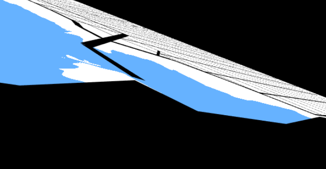

# Homework 6: City Generation

Jason Wang (jasonwa)

External Resources: 
- CIS 460 Rasterizer code

Demo (warning, scene is a bit slow, lowering resolution would provide for a better experience) : https://jwang5675.github.io/hw06-city-generation/

## Implemented Details

- __(Create 3D Environment)__
  - Created a 3D model of the terrain from the last homework assignment. I accomplished this by multiplying the previous homework's position by the camera's view projection matrix
  - 
  - Also, there is a small slope between the water and the land accomplished by using a subdivided plane and then sampling water FBM to lower the vertex position data in the vertex shader.
  - 

- __(Created 3D Roads)__
  - Created a 3D roads. I accomplished this by adding a small y height to the original roads in the previous assignment and then multiplied the roads by the camera's view projection matrix.

- __(Road Rasterization)__
  - Rasterized the roads and water to a grid of resolution 2000 x 2000. I accomplished this with a similar rasterization technique for line segments in CIS 460 HW03 where I intersected horizontal lines on the grid (y = 0, y = 1, etc.) with each road. If there is an intersection, I mark that line on the grid and then add a small delta around the marked point to make the roads appear thicker. For water rasterization, I just sample my FBM texture similar to the previous assignment.
  - Results: (original 3D model on the left vs. rasterized grid view on the right)
  - 

- __(Generating Building Points)__
  - Once the roads and the water have been rasterized, I randomly choose points on the grid and add buildings. I check neighboring grid cells to make sure that I am not over lapping with any roads or water.
  - Result:
  - 

- __(Generate Building Geometry)__
  - I generated the building geometry as described in the figured 3 below using only a cuboid polygon. 
  - 
  - In my generation, in the below example, you can see that the red elongated cuboid represents the original building and all the gray buildings are extruded pieces from the algorithm
  - Top View:
  - 
  - Side View:
  - 
  - The heights also differ accross different population densities. Population near the water is higher compared to the population further away. Replacing the building spots with actual buildings, we get the following scene:
  - 

- __(Generate Building Textures)__
  - TODO

- __(Generating Environment Lighting)__
  - TODO

- __(Procedural Sky Background)__
  - TODO
